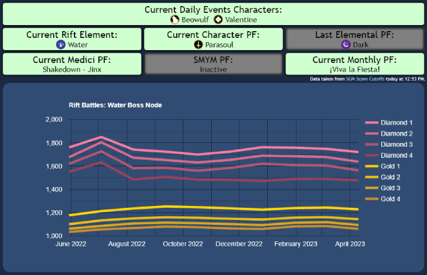

# Skullgirls Mobile Live Schedule

A site to quickly check current events and score histories in Skullgirls Mobile.

Powered by my [SGM Score Cutoffs](https://docs.google.com/spreadsheets/d/1hpmUc__uYo0-tq10tampy7CDIfALn6N5_sMELTBlTOs/edit#gid=814198727) sheet and [Google Chart API](https://developers.google.com/chart).

I made this to be fast, accessible, and accurate. It should never be out of date and it will tell you itself if it is, even when offline.

---

More details of the website's functions and considerations follow below.

- The website automatically updates at SGM's reset time whether the page is refreshed or not.
  - This is possible despite normal API staleness due to an Apps Script trigger which forces the sheet to update at reset time every day, which in turn forces the API to make a fresh request.
  - The website detects timezone changes, so it won't be delayed by Daylight Saving Time transitions.
    - The sheet and script are both set to Pacific Time like the game is, so the data source won't be delayed either.
  - A timestamp displays when the website was last updated.
    - Staleness is indicated by a sepia filter and a yellow timestamp.

- Any data you load will be saved to local storage for future use.
  - This allows the website to be used offline.
    - Offline mode is indicated by a black background and a note next the the timestamp.
  - This makes any subsequent visits significantly faster.
    - A request for new data will be made anyway to ensure fresh data, but the saved data will be shown immediately in the meantime.

- The website is installable as a Progressive Web App.
  - You can add it to your phone's home screen.
  - It has my other sites and official links at the bottom, so it's a pretty useful hub of SGM info.

<!-- redundant now

Concerns

There are several ways for this website to fail.

- Google could shut down their old Chart API.
- Scheduling precision may be lost if Apps Script fails.
- The chain of dependency could break.
  - Score data depends on the SGM Score Cutoffs sheet.
  - Sheet data depends on another Apps Script script.
  - The script depends on the Score Reports forum thread.
  - The thread depends on the developers (mainly Cellsai).
- Timezones may be misaligned (most likely due to DST).
  - The game's reset time is in PT.
  - The sheet is set to "(GMT-08:00) Pacific Time".
    - This is probably a display error. As of this note, the sheet correctly displays time in PDT (GMT-07:00).
  - The scripts are set to "(GMT-07:00) Pacific Time - Los Angeles".
  - The site is in local time.
  - The site also uses the built-in Intl library to check if PT is currently PST or PDT.

-->
